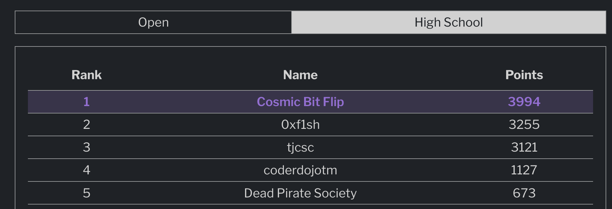

# Introduction

This CTF I played with [Cosmic Bit Flip](https://cosmicbitflip.org). We managed to get a calm 1st place high school win! Thanks to all of my orz teammates:
* c-bass
* anywheres
* wjat
* brew
* mathlegend



More thanks to [les amateurs](https://amateurs.team) for organizing a great CTF with high quality challenges.

Here I'll write about two crypto challenges that wjat and I solved using a timing side-channel.


## What the server did

```python title=chall.py
#!/usr/local/bin/python
from Crypto.Util.number import *
from random import getrandbits, choice
import hashlib

flag = open('flag.txt','rb').read().strip()
flag = bytes_to_long(flag) << 256

n = getPrime(1024) * getPrime(1024)
e = 3

print(f'{n, e = }')

while True:
    cs = [flag + getrandbits(256) for _ in range(100000)]
    scramble = int(input('scramble the flag: '))

    ms = [(m + scramble)%n for m in cs]

    print('scrambling...')

    c = choice([pow(m, e, n) for m in ms])
    print(f'{c = }')
```

Here, the server:
1. Generates an RSA modulus $n$ and uses $e = 3$, then prints these values
2. It builds a list `cs = [flag_shifted + getrandbits(K) for _ in range(100000)]`.
  - addition2: flag shifted left 256 bits, $K = 256$.
  - addition3: flag shifted left 512 bits, $K = 512$.
3. It asks for an integer $\text{scramble}$.
4. It computes `ms = [(m + scramble) % n for m in cs]`.
5. It computes `cands = [pow(m, e, n) for m in cs]`, and prints one random choice of these ciphertexts.

**Key observation**: the inner loops are *repeated 100,000* times, implying that tiny timing differences are massively amplified.

## Where's the leak?

Let $F$ be the integer flag after the left shift ($F = \text{flag} << \text{shift}$). For a candidate padding $r$ we have $m = F + r$, $r$ being the random bytes. When we send a scramble $S$ the server computes:
$$
A = m + S = F + r + S
$$

Now, two operations within the 100k loop depend on $A$:
- Reduction: `A % n`
- Modular exponentiation: `pow(A, e, n)`. This computes $A^e \pmod{n}$. The cost of this grows with the bit-length of the base $A$. If $A$ is small, then repeated exponentiation is faster; if $A$ is near $n$ when mod $n$, exponentiation is much slower.

We found in practice that `pow` dominates the wall-clock difference on our machine: large effecive bases lead to much slower `pow`, amplified by 100k. Roughly, it might take $3$ seconds instead of $0.5$.

A very robust probe is to send $S = -F_{\text{guess}}$.

Then per candidate:
$$
A = (F + r) - F_\text{guess} = (F - F_\text{guess}) + r
$$

- If $F_\text{guess} << F$, $(F - F_\text{guess})$ is large positive and dominates $r$, leading to a *positive* $A$ and a small base, making it **FAST**.
- If $F_\text{guess} > F$, $(F - F_\text{guess})$ is negative and dominates $r$, leading to a *negative* $A$ and a large base, making it **SLOW**.

Note that a positive $A = (F + r + S)$ is going to be much smaller than $n$. So, when it is positive, $A \pmod{n} \equiv A$, which is a small base for `pow`. When $A$ is negative, $A \pmod{n}$ becomes $n - |A|$ (a number very close to $n$), which is a huge base.

This gives us a stable oracle to search for the flag: **FAST** $\implies$ guess too low, **SLOW** $\implies$ guess too high.

## How we turned the timing leak into an attack

For addition2, we could do a whole-value binary search ont he value $F$. This only look roughly 500 or so queries, and if we used the flag format this would reduce further.

For addition3, there was more noise introduced (512 bits), so we did a byte-by-byte guess, and used null byte padding as a suffix. This makes guesses monotonically ordered by the byte we are testing; the transition **FAST** to **SLOW** falls exactly at the correct byte.

### Solve script for addition2

```python title=solve.py
import time
from tqdm import trange
from pwn import *
from Crypto.Util.number import *

g1 = b"amateursCTF{" + bytes(48) + b"}"
g1 = bytes_to_long(g1) << 256
g2 = b"amateursCTF{" + bytes(48) + b"}"
g2 = bytes_to_long(g2) << 256

def get_time(sus_flag):
    chall.sendline(str(-sus_flag).encode())
    start = time.time()
    chall.recvuntil(b':')
    return time.time() - start

chall = process(['python3', 'chall.py'])
# chall = remote('amt.rs', 38593)
msg = chall.recvuntil(b':').decode()

for _ in trange(472):
    g3 = (g1 + g2)//2
    if get_time(g3) >= 1:
        g2 = g3
    else:
        g1 = g3

print(long_to_bytes(g3))
```

That's the binary-search approach, here is the solve script for addition3:

### Solve script for addition3

```python title=solve.py
#!/usr/bin/env python3
from pwn import *
from Crypto.Util.number import *
import time

LOCAL = False
TIME_THRESHOLD = 1.5

FLAG_LEN = 52
FLAG_SHIFT = 512
RANDOM_BITS = 512

PREFIX = b"amateursCTF{"
SUFFIX = b""
MIDDLE_LEN = FLAG_LEN - len(PREFIX) - len(SUFFIX)

CHARSET = list(range(48, 127))

def get_connection():
    if LOCAL:
        return process(['python3', 'chall.py'])
    else:
        return remote('amt.rs', 5959) 

def solve():
    known_middle = b""
    r_max = (2**RANDOM_BITS) - 1
    
    conn = get_connection()

    n_line = conn.recvline().decode()
    n, e = eval(n_line.split(" = ")[1])

    for i in range(MIDDLE_LEN):
        log.info(f"Solving for byte {i}...")
        last_fast_byte = -1
        
        for b_val in CHARSET:
            current_middle_guess = known_middle + bytes([b_val])
            padded_middle = current_middle_guess.ljust(MIDDLE_LEN, b'\x00')
            full_guess_bytes = PREFIX + padded_middle + SUFFIX
            
            F_guess = bytes_to_long(full_guess_bytes) << FLAG_SHIFT

            scramble = n - r_max - F_guess
            conn.recvuntil(b'scramble the flag: ')
            
            start_time = time.time()
            conn.sendline(str(scramble).encode())
            
            conn.recvline()
            conn.recvline()
            duration = time.time() - start_time
            print(f"duration was {duration} for char {b_val}")
            
            n_line = conn.recvline().decode()
            n, e = eval(n_line.split(" = ")[1])
            
            if duration < TIME_THRESHOLD:
                last_fast_byte = b_val
            else:
                log.info(f"  -> Guess '{chr(b_val)}' was SLOW ({duration:.2f}s). Transition found.")
                break
                
        if last_fast_byte == -1:
            log.error(f"Failed to find any fast response for byte {i}. Threshold might be wrong or char not in charset.")
            break
            
        known_middle += bytes([last_fast_byte])
        log.success(f"Solved byte {i}: {PREFIX.decode()}{known_middle.decode()}...")

    final_flag = PREFIX + known_middle + SUFFIX
    log.success(f"Recovered Flag: {final_flag.decode()}")
    conn.close()

if __name__ == "__main__":
    solve()
```
