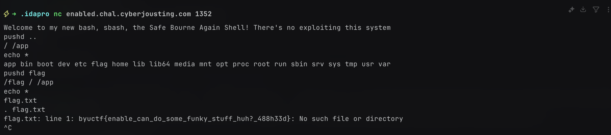

# Enabled

> We're doing a little bit of sanitizing and a whole lot of restriction on what you can run. Good luck.

included the `jail.sh`:

```sh title=jail.sh
#!/bin/bash

unset PATH
enable -n exec
enable -n command
enable -n type
enable -n hash
enable -n cd
enable -n enable
set +x

echo "Welcome to my new bash, sbash, the Safe Bourne Again Shell! There's no exploiting this system"

while true; do
    read -p "safe_bash> " user_input

    # Check if input is empty
    [[ -z "$user_input" ]] && continue

    case "$user_input" in
        *">"*|*"<"*|*"/"*|*";"*|*"&"*|*"$"*|*"("*|*"\`"*) echo "No special characters, those are unsafe!" && continue;;
    esac

    # Execute only if it's a Bash builtin
    eval "$user_input"
done
```

## Solvepath

there are ways to get out of this restricted bash, like repopulating `$PATH` or by navigating to `/bin` using `pushd`.

but, i decided to do it without any of that, and the key idea is that you can change directories using `pushd` and get a version of `ls` using `echo *`



