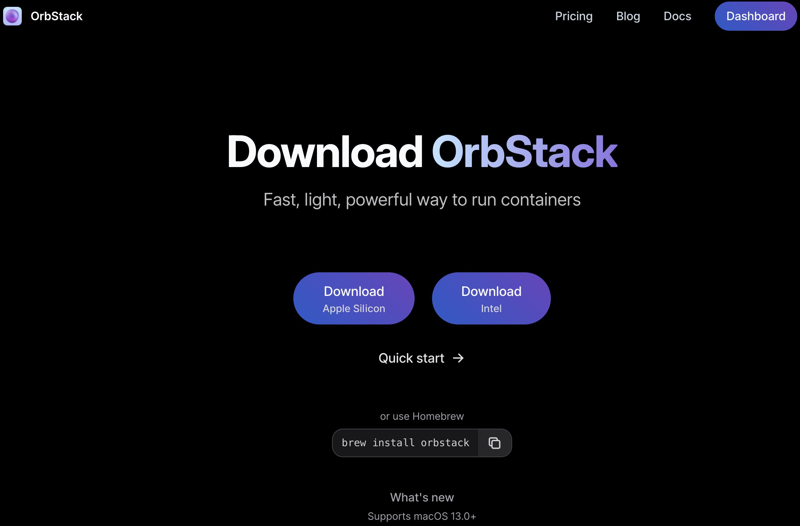

# Introduction

In this guide we will set up a Linux virtual machine for Apple Silicon computers (e.g M1).

Linux itself is an open-source operating system. Some of you may know it as the “hacker” OS or as a very nerdy piece of software, but it is actually used to power the majority of the world’s websites and servers. Some interact with Linux over a graphical interface like you may be used to, but others use a text-based interface, like the terminal you’ll be using in this tutorial. In fact, many of our CTF problems run on Linux, and our binary exploitation problems are Linux programs!

Instead of using [Docker](https://www.docker.com) to run a Linux container, in Mac [OrbStack](https://www.orbstack.dev).

## Why not use Docker?

Docker Desktop on Mac just sucks man. Not the Docker engine, but Docker Desktop has been really inefficient in my experience.

I really like OrbStack.

# Setup

## Installing OrbStack

OrbStack is just another Mac app. Go to [this download page](https://orbstack.dev/download) and follow the instructions. Generally, if you are here, you will have **Apple Silicon**, so make sure to select the right download.

You can also use [Homebrew](https://brew.sh) to install if you wish.

```bash
brew install orbstack
```



## Creating a Linux container

Check out the [offical OrbStack guide](https://docs.orbstack.dev/machines/) for a more detailed explanation.

Let's stick with Ubuntu. To create a container, go to the "machines" tab and create a new container. Make sure:
* It uses **Intel** architexture. Most software we will work with is generally written for x86_64.

Click on the "Machines" tab in OrbStack and create a new machine. Make sure to select x86_64. You can also create an ARM machine as well, you will be able to run programs compiled for either architexture then!

## Working with a Linux container

To drop into a shell in the container you can go to your terminal.
