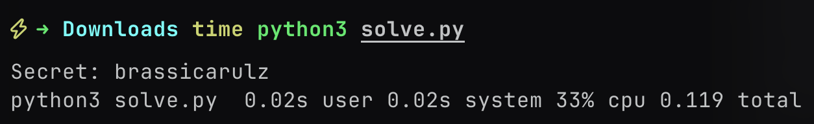

# Introduction

Yet another random small(ish) ctf that I played. This one also had a lot of fun osint that we blooded(?)/did pretty well on. But I forgot to write about it. Just remember @tien rambling about Molly.

## Rev/Constant Folding


> I just finished writing my very own super secret encryption program. I'm so confident in its security that I'll give you the binary and the output of my program! Bet you can't figure out the secret I gave it >:)
>
> Output of the program: bypkrpihayqo
>
> Note: put the input to the program inside sdctf{} before submitting


We were given a program script and asked to find an input string such that:

```python
encrypt(input) == "bypkrpihayqo"
```

```cpp
int __fastcall main(int argc, const char ** argv, const char ** envp) {
    void * v3; // rsp
    void * v4; // rsp
    void * v5; // rsp
    void * v6; // rsp
    void * v7; // rsp
    char v10[8]; // [rsp+0h] [rbp-70h] BYREF
    __int64 v11; // [rsp+8h] [rbp-68h]
    char * s; // [rsp+10h] [rbp-60h]
    __int64 v13; // [rsp+18h] [rbp-58h]
    char * src; // [rsp+20h] [rbp-50h]
    __int64 v15; // [rsp+28h] [rbp-48h]
    char * dest; // [rsp+30h] [rbp-40h]
    __int64 v17; // [rsp+38h] [rbp-38h]
    char * v18; // [rsp+40h] [rbp-30h]
    __int64 v19; // [rsp+48h] [rbp-28h]
    char * v20; // [rsp+50h] [rbp-20h]
    unsigned __int64 v21; // [rsp+58h] [rbp-18h]

    v21 = __readfsqword(0x28 u);
    v11 = 12;
    v3 = alloca(16);
    s = v10;
    printf("Enter your secret: ");
    fgets(s, 13, _bss_start);
    v13 = 84;
    v4 = alloca(96);
    src = v10;
    gen_padding(v10, 13, 4);
    v15 = 96;
    v5 = alloca(112);
    dest = v10;
    strcpy(v10, s);
    strcat(dest, src);
    v17 = 96;
    v6 = alloca(112);
    v18 = v10;
    shuffle(dest, v10);
    v19 = 12;
    v7 = alloca(16);
    v20 = v10;
    fold(v18, v10);
    printf("Your processed secret: %s\n", v20);
    return v21 - __readfsqword(0x28 u);
}
unsigned __int64 __fastcall gen_padding(__int64 a1) {
    int i; // [rsp+1Ch] [rbp-24h]
    int j; // [rsp+20h] [rbp-20h]
    char v4[13]; // [rsp+2Bh] [rbp-15h] BYREF
    unsigned __int64 v5; // [rsp+38h] [rbp-8h]

    v5 = __readfsqword(0x28 u);
    strcpy(v4, "jvucsiwfaebq");
    for (i = 0; i <= 6; ++i) {
        for (j = 0; j < 12; ++j)
            *
            (_BYTE * )(a1 + 12 * i + j) = (i + 3) * j * (v4[j] - 97) % 26 + 97;
    }
    return v5 - __readfsqword(0x28 u);
}

__int64 __fastcall shuffle(__int64 a1, __int64 a2) {
    __int64 result; // rax
    int i; // [rsp+18h] [rbp-8h]

    for (i = 0; i < 96; ++i)
        *
        (_BYTE * )(i + a2) = * (_BYTE * )(17 * i % 96 + a1);
    result = a2 + 96;
    *(_BYTE * )(a2 + 96) = 0;
    return result;
}

unsigned __int64 __fastcall fold(char * a1, __int64 a2) {
    void * v2; // rsp
    void * v3; // rsp
    void * v4; // rsp
    void * v5; // rsp
    void * v6; // rsp
    void * v7; // rsp
    void * v8; // rsp
    void * v9; // rsp
    __int64 v11; // [rsp+0h] [rbp-C0h] BYREF
    char * src; // [rsp+8h] [rbp-B8h]
    int i; // [rsp+10h] [rbp-B0h]
    int j; // [rsp+14h] [rbp-ACh]
    int k; // [rsp+18h] [rbp-A8h]
    int v16; // [rsp+1Ch] [rbp-A4h]
    int v17; // [rsp+20h] [rbp-A0h]
    int v18; // [rsp+24h] [rbp-9Ch]
    __int64 v19; // [rsp+28h] [rbp-98h]
    char * dest; // [rsp+30h] [rbp-90h]
    __int64 v21; // [rsp+38h] [rbp-88h]
    char * v22; // [rsp+40h] [rbp-80h]
    __int64 v23; // [rsp+48h] [rbp-78h]
    char * v24; // [rsp+50h] [rbp-70h]
    __int64 v25; // [rsp+58h] [rbp-68h]
    char * v26; // [rsp+60h] [rbp-60h]
    __int64 v27; // [rsp+68h] [rbp-58h]
    char * v28; // [rsp+70h] [rbp-50h]
    __int64 v29; // [rsp+78h] [rbp-48h]
    char * v30; // [rsp+80h] [rbp-40h]
    __int64 v31; // [rsp+88h] [rbp-38h]
    char * v32; // [rsp+90h] [rbp-30h]
    __int64 v33; // [rsp+98h] [rbp-28h]
    char * v34; // [rsp+A0h] [rbp-20h]
    unsigned __int64 v35; // [rsp+A8h] [rbp-18h]

    src = a1;
    v11 = a2;
    v35 = __readfsqword(0x28 u);
    v16 = 48;
    v17 = 24;
    v18 = 12;
    v19 = 47;
    v2 = alloca(48);
    dest = (char * ) & v11;
    v21 = 47;
    v3 = alloca(48);
    v22 = (char * ) & v11;
    v23 = 47;
    v4 = alloca(48);
    v24 = (char * ) & v11;
    strncpy((char * ) & v11, a1, 0x30 u);
    strncpy(v22, & src[v16], v16);
    for (i = 0; i < v16; ++i)
        v24[i] = (dest[i] - 97 + v22[i] - 97) % 26 + 97;
    v25 = v17 - 1 LL;
    v5 = alloca(16 * ((v17 + 15 LL) / 0x10 uLL));
    v26 = (char * ) & v11;
    v27 = v25;
    v6 = alloca(16 * ((v17 + 15 LL) / 0x10 uLL));
    v28 = (char * ) & v11;
    v29 = v25;
    v7 = alloca(16 * ((v17 + 15 LL) / 0x10 uLL));
    v30 = (char * ) & v11;
    strncpy((char * ) & v11, v24, v17);
    strncpy(v28, & v24[v17], v17);
    for (j = 0; j < v17; ++j)
        v30[j] = (v26[j] - 97 + v28[j] - 97) % 26 + 97;
    v31 = v18 - 1 LL;
    v8 = alloca(16 * ((v18 + 15 LL) / 0x10 uLL));
    v32 = (char * ) & v11;
    v33 = v31;
    v9 = alloca(16 * ((v18 + 15 LL) / 0x10 uLL));
    v34 = (char * ) & v11;
    strncpy((char * ) & v11, v30, v18);
    strncpy(v34, & v30[v18], v18);
    for (k = 0; k < v18; ++k)
        *
        (_BYTE * )(k + v11) = (v32[k] - 97 + v34[k] - 97) % 26 + 97;
    *(_BYTE * )(v18 + v11) = 0;
    return v35 - __readfsqword(0x28 u);
}
```

The binary contains a few key functions:

- `generate_padding()`: produces a fixed 84-character padding string from a hardcoded source "jvucsiwfaebq".
- `shuffle(buffer)`: reorders a 96-character buffer based on some indices, call that `SHUFFLE_INDICES`.
- `fold(buffer)`: compresses the buffer from 96 → 48 → 24 → 12 characters using mod-26 character addition.
- `main(input)`: applies padding, shuffle, then fold to return a final 12-character string.

It's trivial to attempt a brute force. But, the brute-force method is clearly inefficient, so we analyze and reverse the operations.

### Understanding Shuffle

`SHUFFLE_INDICES[i] = (i * 17) % 96` for `i` in `0..95`

Since 17 is coprime to 96, the mapping is bijective and thus reversible. To invert:

```python
reverse_shuffle[i] = j # where SHUFFLE_INDICES[j] = i
# that is:
reverse_shuffle[SHUFFLE_INDICES[i]] = i
```

More compactly, since 17 \* 17 ≡ 1 mod 96, the modular inverse of 17 mod 96 is 17. So to reverse:

```python
original[j] = shuffled[(j * 17) % 96]
```

This lets us reconstruct the original input+padding buffer from a shuffled one.

Folding is a 3-step reduction:

1. Fold 96 → 48:
   `folded[i] = (ord(S[i]) + ord(S[i+48]) - 194) % 26 + 97`
2. Fold 48 → 24:
   same pattern on result
3. Fold 24 → 12:
   same again to produce final string

Each final output character is a linear combination of 8 shuffled characters:

```python
fold3[m] = (S[m] + S[m+12] + S[m+24] + S[m+36] + S[m+48] + S[m+60] + S[m+72] + S[m+84]) % 26
```

Each `S[i]` maps to either:

- An input character (if SHUFFLE_INDICES[i] < 12), or
- A known padding character (SHUFFLE_INDICES[i] ≥ 12 → padding[SHUFFLE_INDICES[i] - 12])

This allows us to express each fold3[i] (i.e., target character) as a linear sum of one unknown and 7 knowns.

1. For each i in 0..11 (target character):

   - Identify the 8 contributing positions in the shuffled buffer: i, i+12, ..., i+84
   - For each, map SHUFFLE_INDICES[pos]
   - If SHUFFLE_INDICES[pos] < 12 → input[SHUFFLE_INDICES[pos]] is unknown
   - Otherwise → add padding value to sum

2. Each target character gives a direct equation:
   x_k = (target_val - sum_of_padding_contributions) % 26

3. Construct input string from x_0 .. x_11

```python
import string

# Precomputed padding generation
def generate_padding():
    src = "jvucsiwfaebq"
    padding = []
    for i in range(7):  # 0-6 inclusive (7 rows)
        for j in range(12):
            c = ord(src[j]) - ord('a')
            val = (c * j * (i + 3)) % 26
            padding.append(chr(val + ord('a')))
    return ''.join(padding)

PADDING = generate_padding()
SHUFFLE_INDICES = [(i * 17) % 96 for i in range(96)]

def compute_input_vars(target):
    input_chars = [None] * 12
    target_nums = [ord(c) - ord('a') for c in target]

    for m in range(12):
        sum_padding = 0
        input_idx = None
        for k in range(8):
            i = m + 12 * k
            buffer_idx = SHUFFLE_INDICES[i]
            if buffer_idx < 12:
                input_idx = buffer_idx
            else:
                pad_val = ord(PADDING[buffer_idx - 12]) - ord('a')
                sum_padding += pad_val
        if input_idx is None:
            raise Exception("No input variable found")
        input_val = (target_nums[m] - sum_padding) % 26
        input_chars[input_idx] = chr(input_val + ord('a'))

    return ''.join(input_chars)

TARGET = "bypkrpihayqo"
secret = compute_input_vars(TARGET)
print("Secret:", secret)
```

Running the above returns the 12-character secret input that produces the encrypted target "brassicarulz".

_it's sure a hell of a lot faster than the probably 500 years needed to brute-force LMAO_


No brute-force required; we reverse-engineered the constant-folded structure mathematically.

**flag is:** `sdctf{brassicarulz}`.

Instead of blindly brute-forcing, we recognize structure in the transformations (especially the fold’s linear nature and the shuffle's bijective mapping), and turn the encryption into a solvable system of modular equations.

Simple linear algebra over Z/26Z beats brute force.
