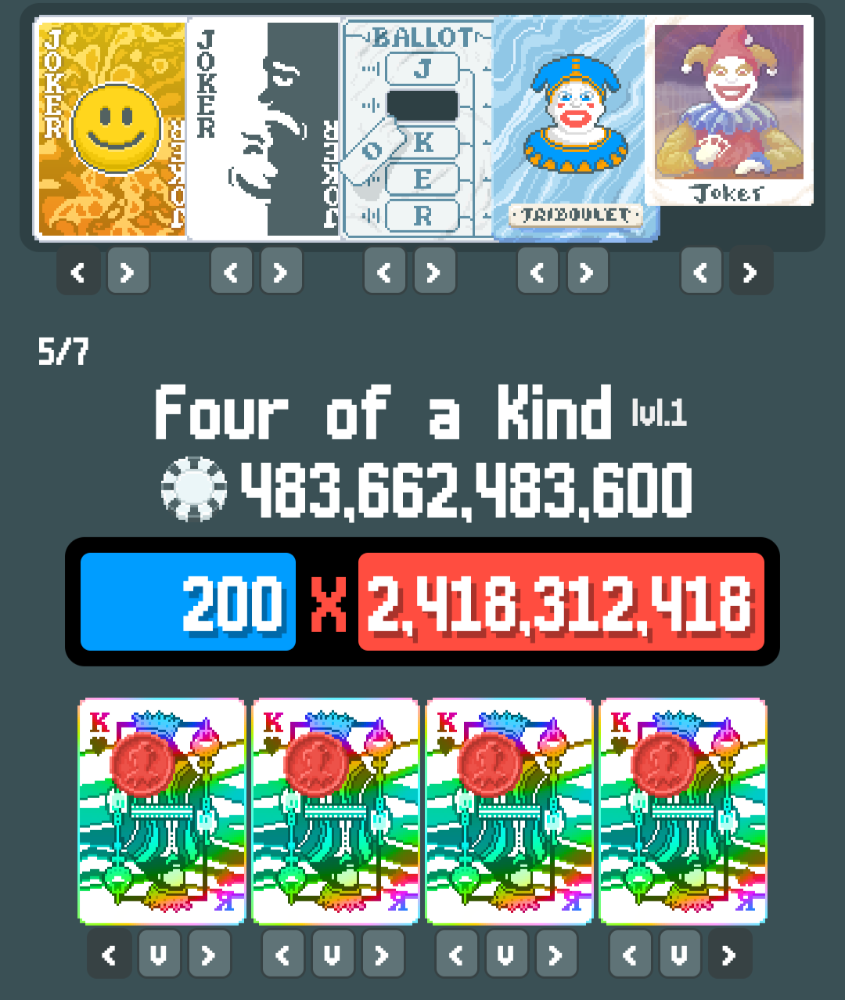
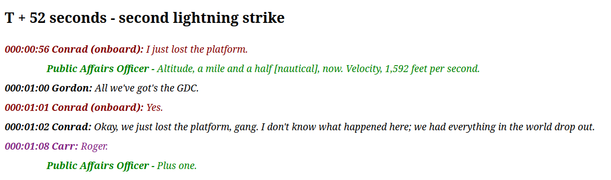
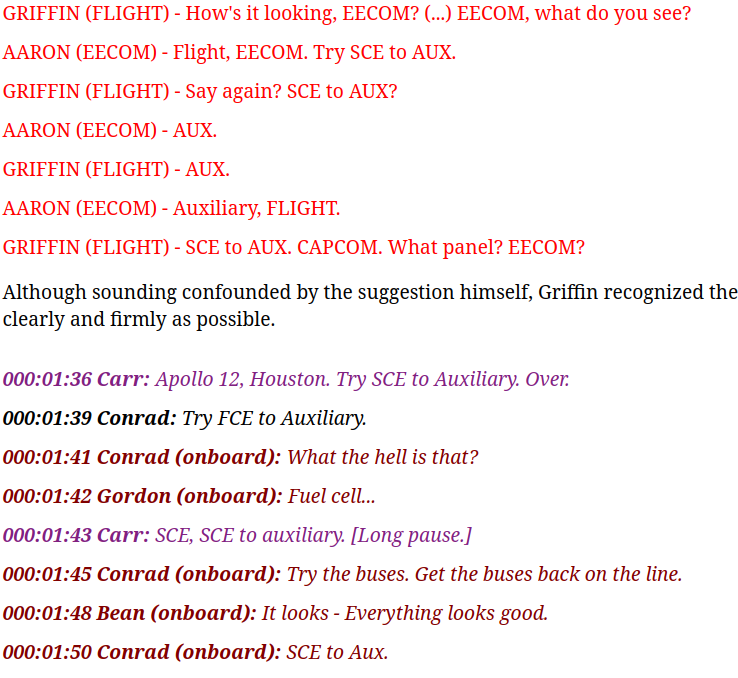
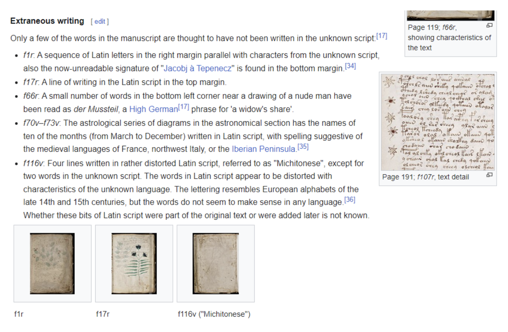
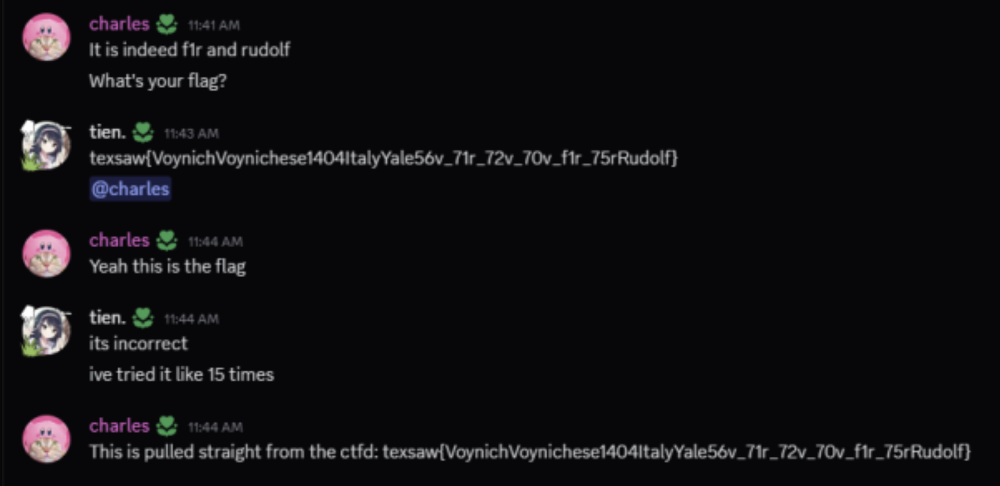
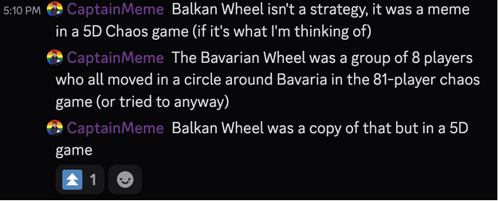
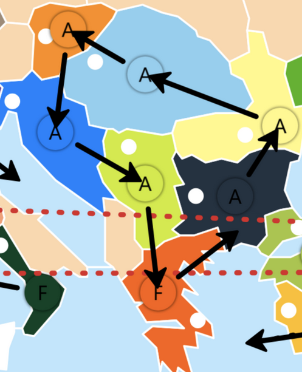

# Introduction

This CTF was one of the first CTFs I played with my high school team [Bing Chilling Academies](https://ctftime.org/team/283028). Such, it holds a couple of fond memories for me. We did a lot of OSINT and not a whole lot of regular CTFing but it was quite fun.

Btw, @tien still owes me a Brawl Pass.

## Rev

*So this is the challenge that I solved in the last few minutes of the CTF. It is also the reason I am owned a Brawl Pass.*
> easy-rev: functional edition (with all new (old) list module!)

opening the binary in Ghidra, we see a lot of OCaml functions, so its quite hard to study it and reverse engineer. it even look a bit of time to find the main function, until i finally found this function (and realized that the binary functions start with `camlEasy_rev__entry`)

here is the dissassembly of the main function

```cpp
void camlEasy_rev__entry(void)

{
  undefined8 extraout_RAX;
  undefined8 extraout_RAX_00;
  undefined8 extraout_RAX_01;
  undefined8 *extraout_RAX_02;

  camlEasy_rev = &camlEasy_rev__10;
  DAT_001a5e20 = &camlEasy_rev__20;
  DAT_001a5e28 = &camlEasy_rev__30;
  camlStdlib__$40_198();
  camlStdlib__$40_198();
  DAT_001a5e38 = &camlEasy_rev__38;
  DAT_001a5e30 = extraout_RAX;
  camlStdlib__List__map_482();
  DAT_001a5e40 = extraout_RAX_00;
  camlStdlib__List__fold_left_521();
  DAT_001a5e48 = extraout_RAX_01;
  camlStdlib__Printf__fprintf_422();
  (*(code *)*extraout_RAX_02)();
  return;
}
```

also, when we run the binary, we see the output **sum of all flag elements: 2836**. this suggest that we have a list of the flag's ascii charcodes, and we are summing and outputting it.

so, the function `camlStdlib__List__fold_left_521` is hella sus. you probably cld continue w/ static dissassembly but atp i got bored and moved to gdb to write this script to solve. (the real reason is that ocaml binaries are really annoying and i was bad at rev when i did this ctf.)

```cpp
set pagination off
break camlStdlib__List__fold_left_521
commands
  printf "---- FOLD ENTER ----\n"
  printf "RDI: 0x%lx\n", $rdi
  printf "RAX: 0x%lx\n", $rax
  continue
end

break *camlStdlib__List__fold_left_521+52
commands
  printf "Element: %d (0x%lx)\n", (($rbx - 1) >> 1), $rbx
  printf "New acc: %d (0x%lx)\n", (($rax - 1) >> 1), $rax
  continue
end

run
```

reading through and converting from char code we get the flag
`texsaw{a_b1t_0f_0c4ml_r3v3rs3}`


## Crypto

### Brainstorming

> My friend is such a Joker, he has been sending me packets of data like the one attached, I can't decrypt it! can you?

we open the **packet.txt** to see that it is in binary. trivially using cyberchef reveals it has multiple layers, so my lazy bum decides to use [Ciphey](https://github.com/bee-san/Ciphey) which is a **very orz automatic decryption tool**.

This gives me the message

```
secp256k1;Jkr:SmiFc,S&B,HChd,Trib,Photo;4OAK-L1;AS,KC,9D,10H;KH-PC-MULT-RS,KH-PC-MULT-RS,KH-PC-MULT-RS,KH-PC-MULT-RS;Vou:;Cons:;TG:;

Public Key: 03f3e48a2f1cc1862009fc9870abb15ce8c518cec484bd3c13324d1ce8b1a44188
IV: afe45a5920a00137904b1bdcb2c52bc7
Ciphertext: 2ecedcbbd781290a0960d5d3b0a7ec7f
```

trivially, we can see that its referencing elliptic curve cryptography, but we're missing a private key. that's where the segment `Jkr:SmiFc,S&B,HChd,Trib,Photo;4OAK-L1;AS,KC,9D,10H;KH-PC-MULT-RS,KH-PC-MULT-RS,KH-PC-MULT-RS,KH-PC-MULT-RS;Vou:;Cons:;TG:;` comes in. it seems like jkr = **joker**, and by searching for card games we stumble across [Balatro](https://balatrogame.fandom.com/wiki/Balatro_Wiki).

since we never played this game before, we enlisted the help of someone from the Balatro discord, and they helped us to construct the score using this website: [https://efhiii.github.io/balatro-calculator/](https://efhiii.github.io/balatro-calculator/).

after a couple of tries (shout out to my boy Juan) we got this:


so we have the number `483662483600` to use as a private key.

tbh since im not the crypto goat i asked my good friend and mentor ChatGPT who gave me this script after a bit of encouragement:

```python
from coincurve import PrivateKey
from Crypto.Cipher import AES
from Crypto.Hash import SHA256

priv_int = 483662483600
iv = bytes.fromhex("afe45a5920a00137904b1bdcb2c52bc7")
ciphertext = bytes.fromhex("2ecedcbbd781290a0960d5d3b0a7ec7f")
pubkey = bytes.fromhex(
    "03f3e48a2f1cc1862009fc9870abb15ce8c518cec484bd3c13324d1ce8b1a44188"
)

privkey = PrivateKey.from_int(priv_int)
assert privkey.public_key.format() == pubkey

aes_key = SHA256.new(privkey.public_key.format(compressed=False)[1:33]).digest()
cipher = AES.new(aes_key, AES.MODE_CBC, iv)
plaintext = cipher.decrypt(ciphertext)

print("Raw:", plaintext)
print("Hex:", plaintext.hex())

try:
    print("UTF-8:", plaintext.decode("utf-8"))
except:
    pass

import base64

print("Base64:", base64.b64encode(plaintext).decode())
```

And we get the flag: `texsaw{Baloopy}`

## Forensics

### Scrambled Packets

> I accidentally broke my message and it got all mixed up with everything else. Can you help me get it back?

Loading the given pcap in wireshark to see that there are a lot of **ICMP** pings.
looking through a few of them, we see that some of them have sussy **1 byte data** so we extract those using `tshark`, and realize that its junk :(.

lmao it was scrambled, so we sort it by **sequence number** using this command:
```bash
tshark -r cap.pcap -Y "icmp && data.len == 1" -T fields -e icmp.seq -e data | sort -n -k1
```

And we get the flag: `TexSAW{not_the_fake_one}`

## OSINT

### AC/DC

> My friend is flying a spaceship, and is having a problem, he is getting the attached differences in telemetry. Your flag is texsaw\{the instructions on what he should do to fix the problem} the instructions are less than 6 words and might not be words in the english dictionary neccesarily. Put them all in lower case with spaces between them.

Right away we see the mention of AC/DC - but seeing as it mentions spaceships, the band is unlikely.
Instead we start thinking about electrical systems. Opening the attached csv, we see an electrical issue at T=52 seconds.

Most people may not have noticed but by looking at the challenge author OneNameMarty's bio, we can see that he has a quote from the Apollo 11/13 mission director. This clues us towards the Apollo missions.

A simple [google search](https://www.google.com/search?q=apollo+mission+electrical+issue+52+seconds+90+seconds) leads us here:
[nasa history website](https://www.nasa.gov/history/afj/ap12fj/a12-lightningstrike.html)

And we see some confirmation:


From here, it's only a matter of looking around until we find a "famous phrase" that would fix the issue:


The flag is `texsaw{sce to aux}`.

### Cryptolinguistics

Challenge asks for the following bullet points, I have attached answers to go along with them.

By looking at the image stuff we are provided, we can deduce that it is the Voynich Manuscript. We then find the following link:

[https://collections.library.yale.edu/catalog/2002046](https://collections.library.yale.edu/catalog/2002046)

Most of the information can be googled. Additionally, the Voynich Manuscript Wikipedia comes into use.

Most of this is google, finding page numbers is just sifting through the book. For the first inscription not in primary language, we look at the wikipedia link, and in the section of extraneous writing.



This gives us the part as f1r.

The hardest part in our opinion is the owner. There are many answers when you google, with common ones being Georg Baresch and Jacobus and Athanasius Kircher. However, the most commonly accepted answer is Rudolf II, Holy Roman Emperor. Thus, our answer for this section is Rudolf.

Bolded answers with parts are below:

The first proper noun in the book's title **Voynich**

- Language of book text **Voynichese**
- The earliest year it was likely written in **1404**
- The country it was likely written in **Italy**
- Its current location (one word) **Yale**
- The page number of the large drawing on the right **56v**
- The page number of the ram drawing **71r**
- The page number of the scales drawing **72v**
- The page number of the fish drawing **70v**
- The page number of the first inscription not in the text's primary language that was written by its author (not some later owner) **f1r**
- The page number of the text in the top left (hint: in the second half of the book) **75r**
- First known owner's first name **Rudolf**



Figure 1: A bit of trolling occurred.. We had the right flag for >12 hours but due to a leading whitespace it was wrong!

flag format: `texsaw{VoynichVoynichese1404ItalyYale56v_71r_72v_70v_f1r_75rRudolf}`

-tienxion & cold

## Web

### Deprecated Site

> CSG's left an old webpage up on accident. It's old and deprecated, maybe you should do us a favor and get rid of it?
> `74.207.229.59:20201`

delete HTTP requests exist! `curl -X DELETE 74.207.229.59:20201` gives us the flag.

`texsaw{why_d0_i_del3t3ed}`

### Reinventing the Wheel (written by GS)

> Flag Format: texsaw\{1,2,3,4,...}
>
> What is the Balkan Wheel? Your flag is the set of commands in alphabetical order and correct notation including non-geographic locational and temporal data. (do not include spaces and type only in uppercase), that sets up the conditions for the Balkan Wheel as early as possible, there is no need to include a command that creates the Balkan Wheel. Additionally, the subjects of the commands are all A type.
>
> Where appropriate in the commands, use -> instead of something else include leading zeroes when referencing time.
>
> Hints:
>
>     The next time commands are given after the ones referenced by the flag, all command issuants will have doubled their status
>     The Balkan Wheel first occured on November 8th 2024, its effects were able to be seen until December 30th 2024
>     The Balkan Wheel was planned by 7 human participants
>     The Balkan Wheel may have its most public mention via audio.
>     The Balkan Wheel was planned in a secret channel, now public if you know where to look.

References to geographical locations, “early as possible”, commands indicating something turn based, and A type subject indicated this could be some type of historical strategy game. More specifically, with a focus on Europe as the map or board would have to have ample space for troop movements within the Balkan peninsula.

Following the criteria given in the question initially it was believed that it could be some kind of mobile game, which commonly uses these types of mechanics. However, the inclusion of “A-type units,” after a few minutes of research, pointed to Diplomacy. The game of Diplomacy uses both A and F type units, was turn based, and had a focus on Europe indicating it was part of the correct solution.

Initially, I looked for solutions in 2D diplomacy. As Austria was most closely situated to the Balkans I looked for Austrian strategy guides that could yield results. Some strategy guides mentioned a common opening called the “Balkan Gambit,” a rush with your starter units east and south. Unfortunately, this did not result in a cyclical pattern one would expect in a wheel.

[How to ALWAYS win as Austria in Diplomacy (100% guaranteed)](https://www.youtube.com/watch?v=P5kIGYsmBds)

The solution calling for temporal data indicates that for some reason the time in which the commands were executed was relevant to the solution. Somewhat luckily, I had previously watched the following video, which likely still could have been found quickly if one were to look for Diplomacy played with time manipulation:

[5D Diplomacy (100% GUARANTEE NO BAMBOOZLE)](https://www.youtube.com/watch?v=P_5QCJO4ELI&t=208s)

However, finding references to the “Balkan Wheel” was still challenging as there were no results on YouTube when searched for by name or forum websites. Even searching through the transcripts of some gameplay videos showed no matches. This is when some of my teammates went to different Diplomacy and 5D Diplomacy discords servers and inquired about the strategy, yielding the following:



Confirms the 5D chess theory.

In greater detail (a screenshot from after CTF ended in higher resolution), the image obtained was:



Now that the “Balkan Wheel” was fully discovered all that is left to do is create the orders in accordance with standard and 5D diplomacy conventions and assign temporal markers to the earliest possible date while marking all units moved as type A in alphabetical order:

T1S01ABUD->T1S01VIE

Timeline 1 Spring 1901 Unit A Budapest to Timeline 1 Spring 1901 Vienna

T1S01ABUL->T1S01RUM

Timeline 1 Spring 1901 Unit A Bulgaria to Timeline 1 Spring 1901 Romania

T1S01AGRE->T1S01BUL

Timeline 1 Spring 1901 Unit A Greece to Timeline 1 Spring 1901 Bulgaria

T1S01ARUM->T1S01BUD

Timeline 1 Spring 1901 Unit A Romania to Timeline 1 Spring 1901 Budapest

T1S01ASER->T1S01GRE

Timeline 1 Spring 1901 Unit A Serbia to Timeline 1 Spring 1901 Greece

T1S01ATRI->T1S01SER

Timeline 1 Spring 1901 Unit A Trieste to Timeline 1 Spring 1901 Serbia

T1S01AVIE->T1S01TRI

Timeline 1 Spring 1901 Unit A Vienna to Timeline 1 Spring 1901 Trieste

Formatted into a valid answer:

`texsaw{T1S01ABUD->T1S01VIE,T1S01ABUL->T1S01RUM,T1S01AGRE->T1S01BUL,T1S01ARUM->T1S01BUD,T1S01ASER->T1S01GRE,T1S01ATRI->T1S01SER,T1S01AVIE->T1S01TRI}`

### Tanpin

> I saved this screenshot of a video I liked, but I can't remember what it was! (image.png)
>
> All I remember is that the video was a collaboration (合作) and that it was uploaded sometime last September.
>
> Can you find the following information about the image?
>
>     the YouTube video id of the collaboration (v=???)
>     the audio source (english song title, all lowercase)
>     the visual source (romanized name of the character in the image, all lowercase, given name then surname)
>     the YouTube channel of the author of the part shown in the image (@???, note that this is not the channel that uploaded the full video!)
> Flag format: texsaw\{1,2,3,4}
> If the image was example.png, then the flag would be: texsaw\{dQw4w9WgXcQ,never gonna give you up,rick astley,RickAstleyYT}


tbh it was js **appllo** and I looking thru youtube for hours until we found
[https://www.youtube.com/watch?v=pxyONEf8ZGE&t=3395s](https://www.youtube.com/watch?v=pxyONEf8ZGE&t=3395s)

which matched exactly, and the original clip was [https://www.youtube.com/watch?v=3SbPQDxlHcA](https://www.youtube.com/watch?v=3SbPQDxlHcA)

lowk fire edit btw, and assembling we get the flag to be:

`texsaw{pxyONEf8ZGE,ice drop,aya komichi,ねそ-l9b}`

